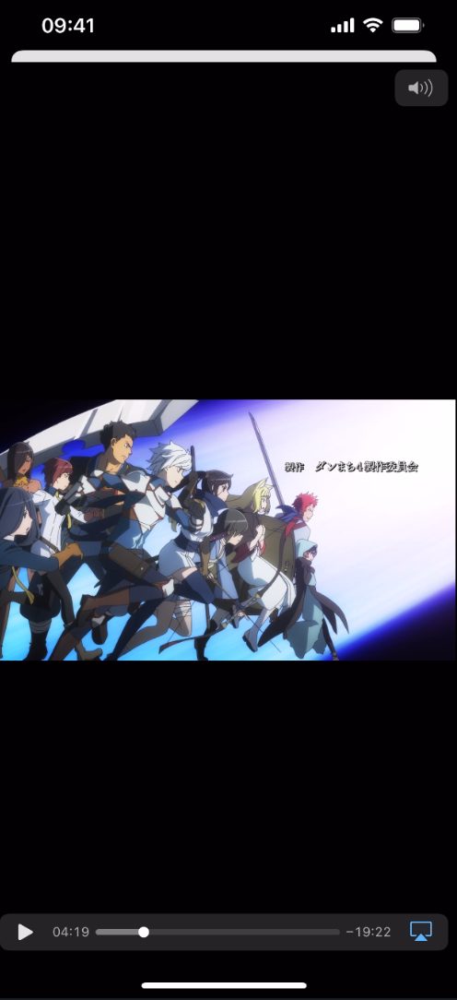
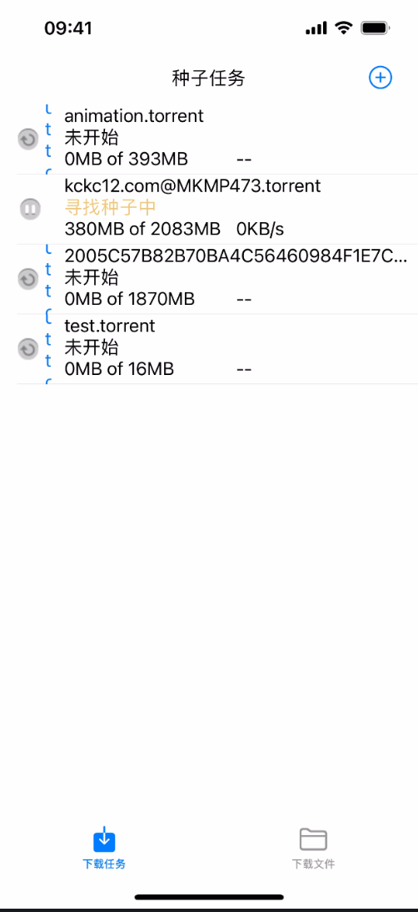
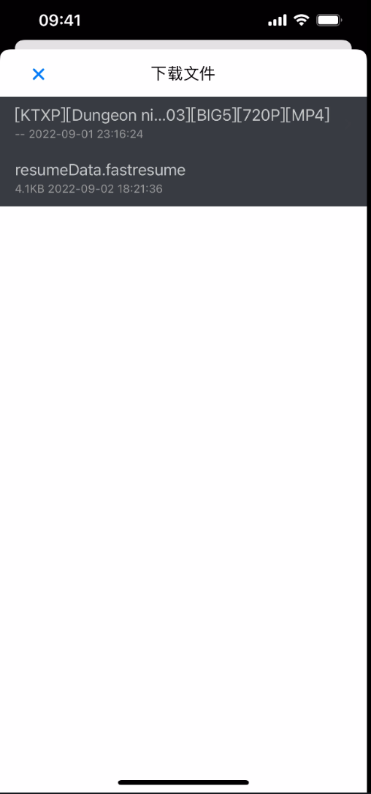

# iosbtdownloader
基于libtorrent，用objective-c编写的bt下载器，支持通过复制UIPasteboard的磁力链接与沙盒获取.torrent文件进行下载
BT downloader based on libtorrent and written in Objective-C，Support  magnet from UIPasteboard and adding seeds through sandbox for downloading tasks

感谢 [kxmovie](https://github.com/kolyvan/kxmovie) 和 [libtorrent.org](https://libtorrent.org)
只要有开发者证书，就可以安装在自己的iPhone上。如果觉得有用，请点个星吧。

Thank for [kxmovie](https://github.com/kolyvan/kxmovie) and [libtorrent.org](https://libtorrent.org)
You can install it through iOS development profile.If you feel helpful, please point a Star~ thank you.. Please contact me with any questions.